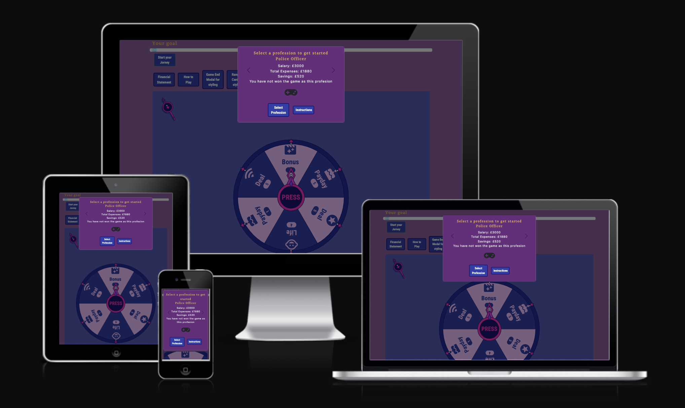
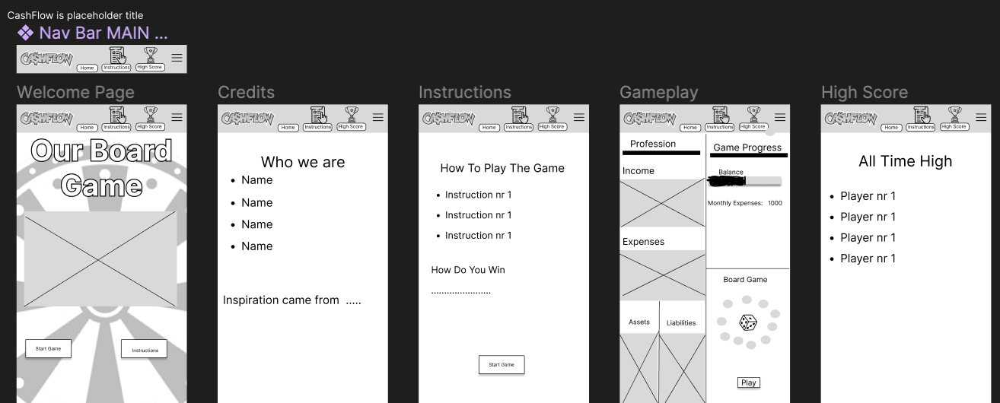
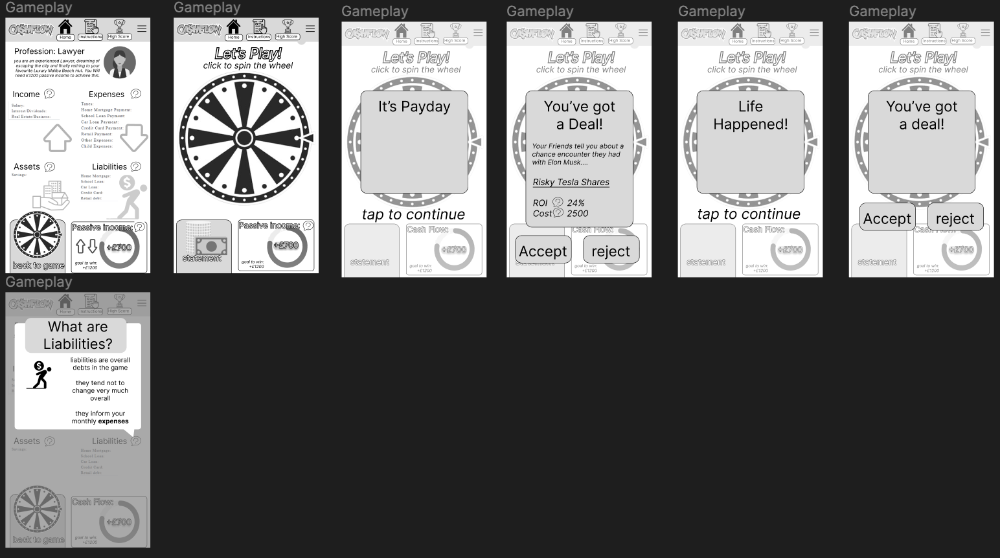
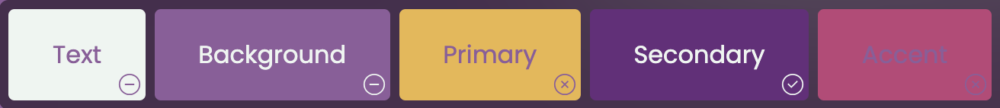
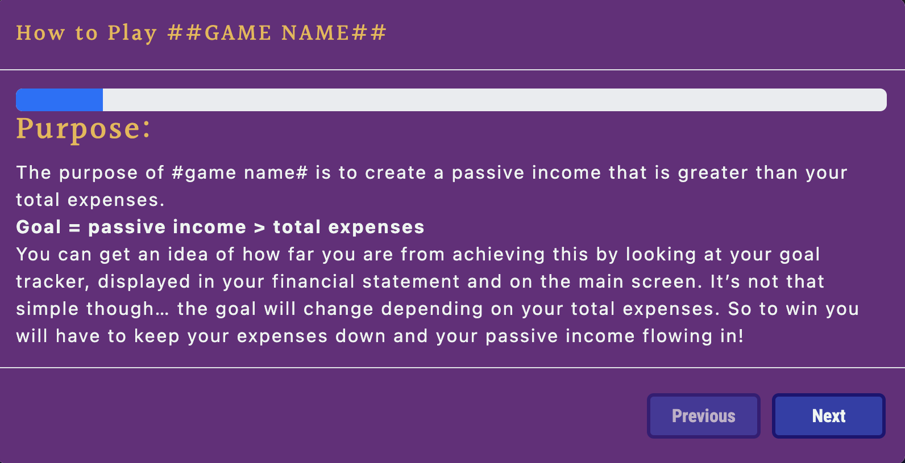
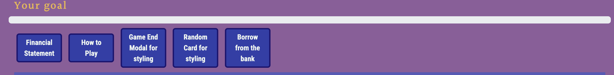
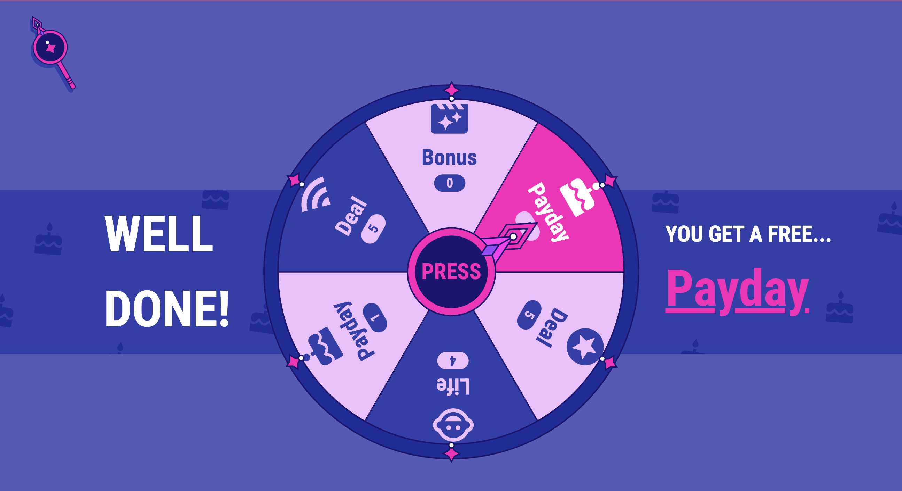
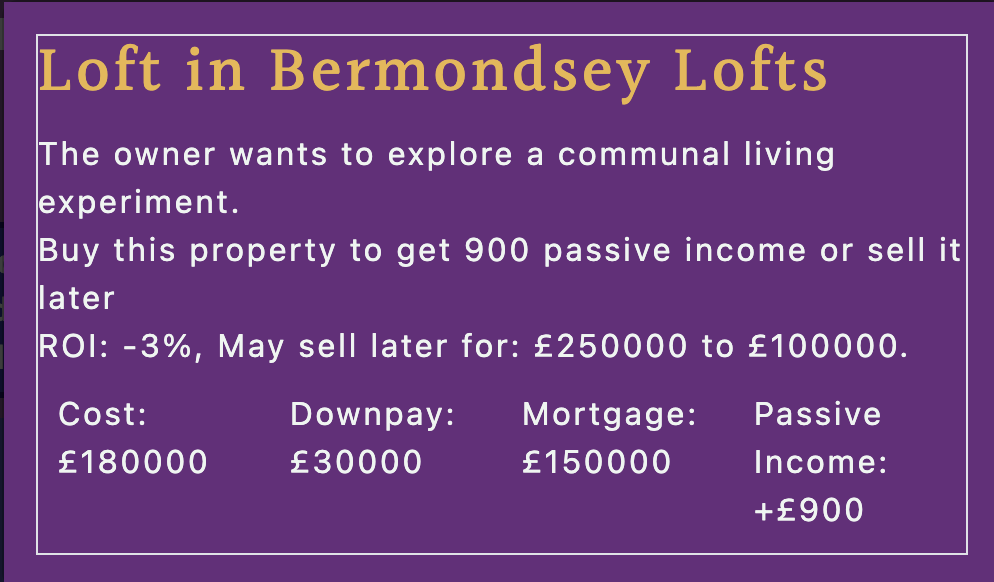
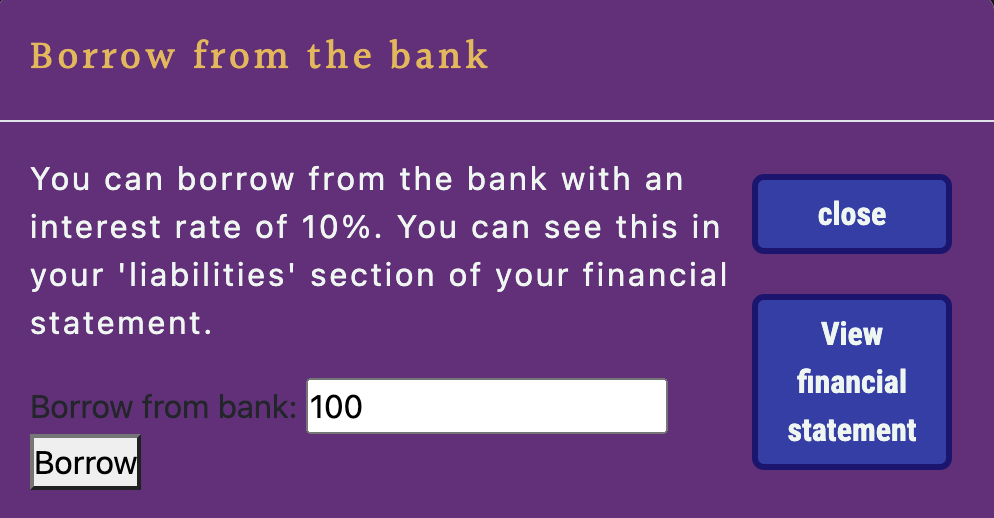
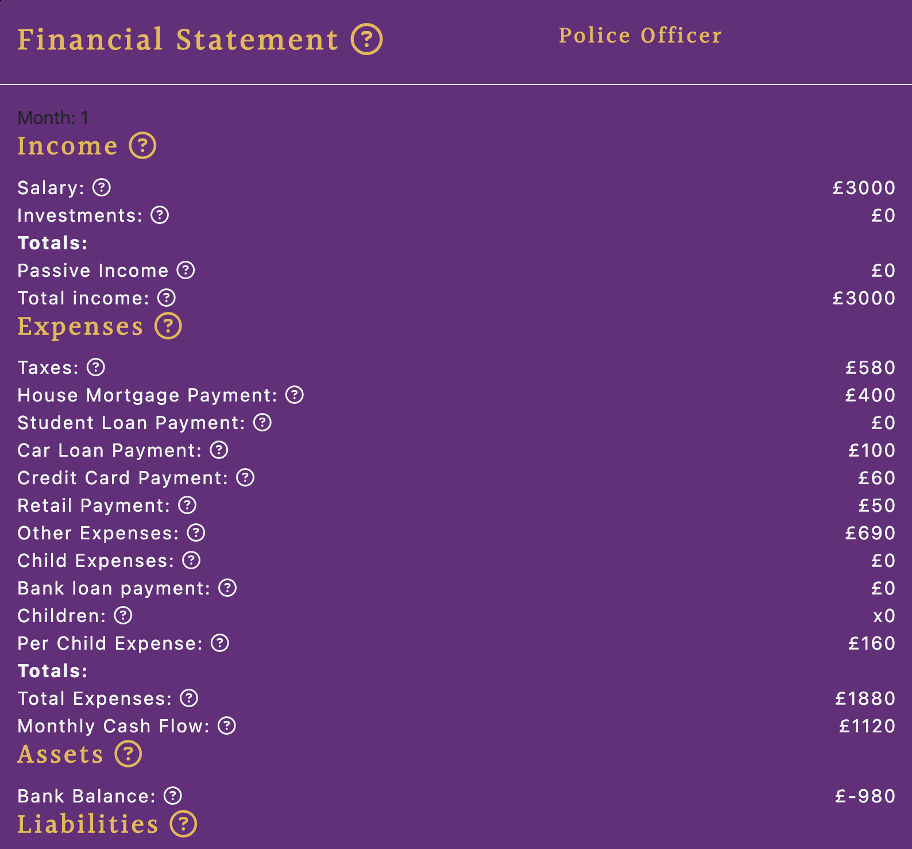

# Wealth Quest

#### By Hackathon Team 6 (Our team names are in the acknowledgements)

[Click here to view the live web application](Live link here)

#### By Hackathon Team 6

[Click here to view the live web application](https://lmcrean.github.io/Wealth-Quest/)

#### HELLO EVERYONE!

This is the documentation for our website: A financial game inspired the original boardgame [Cashflow](https://www.richdad.com/products/cashflow-classic) designed by Robert Kawosaki! It has been built using HTML5, CSS3 and JavaScript as a part of Code Institute's January 2024 hackathon. Disclaimer: This game is not only for entertainment purposes, and should by no means be used for real-world financial planning. Please use the table of contents below to navigate through all of the planning, features, deployment, testing and more!

## Table of Contents

1. [Project Development and Planning](#project-development-and-planning)
   - [Project Goals](#project-goals)
     - [Project Purpose](#project-purpose)
     - [Client Goals](#client-goals)
     - [Target Audience](#target-audience)
   - [Research](#research)
     - [Key Takeaways](#key-takeaways-from-market-review)
   - [User Stories](#user-stories)
   - [Design, Layout and Structure](#design-layout-and-structure)
     - [Wireframes](#wireframes)
     - [Structure and Layout](#structure-and-layout)
     - [Design and Colour](#design-and-colour)
     - [Font](#font)
2. [Technologies Used](#technologies-used)
   - [Languages](#languages)
   - [Tools](#tools)
3. [Features](#features)
   - [Whole Site](#whole-site)
   - [Future Features](#future-features)
4. [Testing](#testing)
   - [Manual Testing](#manual-testing)
     - [Responsiveness / Device Testing](#responsiveness-/-device-testing)
     - [Browser Compatibility](#browser-compatibility)
     - [Solved Bugs](#solved-bugs)
     - [Testing User Stories](#testing-user-stories)
5. [Deployment](#deployment)
6. [Credits](#credits)

## Project Development and Planning

### Project Goals

#### Project Purpose

This game was planned and developed using principles of User Experience (UX) design, which include the five planes of Strategy, Scope, Structure, Skeleton, and Surface. Using these principles, the aim was to create a fun, easy-to-use, responsive, and engaging game that entertains users who are interested in learning more about financial concepts.

#### Client Goals

Our website was built as a part of the January 2024 Budget-Buster-themed hackathon with [Code Institute](https://codeinstitute.net/global/full-stack-software-development-diploma/). It is an interactive game designed to entertain users of all ages and backgrounds who want to learn more about financial planning, particularly those interested in investing, passive income and budgeting. Despite this being built for a hackathon, it was still treated as a real-world application for potential clients interested in learning about how to financially plan in a fun, engaging way. Thus, this client's goals would be:

- Engaging the users with interactive, fun prompts, such as life happenings, deals and expenses
- Helping users learn more about how to spend or save their money
- Entertaining users by giving them different financial scenarios and choices of how to manage them
- Ensuring the questions and options are clear, and the game is simple to navigate

#### Target Audience

- This game is designed for users of any background or age, but will most likely gain more interest from those interested in budgeting, saving and investing
- It is also likely to draw in users who want to play around with different incomes and learn how to generate passive income
- The simplicity of the game makes it easy for adults, teenagers and even children to take, and retake, the game as many times as they want, until they win

### Research

#### Key Takeaways

We reviewed other websites and games to get an idea of how we should implement our design and functionality. These are our key takeaways:

- The website should be eye-catching, to make users excited about playing the game
- The Website should be clean, simple, and easy to navigate
- The game should be fun and easy to navigate through
- The game should be challenging but not too difficult
- The user should feel as if they are winning, but not too easily

### User Stories

As a first-time user, I would like to:

- take part in a fun, interesting game and learn more about financial planning
- find out what the game is about and what to expect before starting
- navigate easily through the game
- be able to view my financial statement at any time in the game
- be able to make choices in the game and see immediate results on my financial statement
- access the game on any device

These user stories gave us a clear scope for the game and enabled us to stay on track with the project, preventing issues like scope creep at a later stage after the coding process.

### Design, Layout and Structure

#### Wireframes

We used [Figma](https://figma.com/) in the initial design phase, before the coding process. This enabled us to develop the game's structure, skeleton, layout and overall look and style. We created designs for desktop, tablet and mobile screens to ensure that responsiveness was at the forefront of the application from the beginning.

Screenshots

_Wireframes_

#### Design and Colour

This site was designed using a mobile-first approach, because after conducting some research (using sites like [Adobe](https://xd.adobe.com/ideas/process/ui-design/what-is-mobile-first-design/)), it appears that most users use their mobile devices over desktop or iPad screens, especially when partaking in quizzes.

- The design includes eye-catching colours of purples and yellows, and a spinning wheel to create a boardgame feel
- A different colour palette was used for the progress bar to differentiate it from the rest of the game elements
- The game is setup on one screen with numerous modals being shown and hidden as the game progresses
- The colours applied to the buttons, headings and font are all consistent throughout

Screenshots

_Colour Palette for entire website_

#### Font

Our choice of font was [Roboto](https://fonts.google.com/specimen/Roboto). The light font was used for all paragraphs and and the bold font was used for all headings and buttons. This font choice was imported from [Google Fonts](https://fonts.google.com/) and had a backup font of Serif. We chose this font for my website because the style contributed to the financial game theme, whilst also providing a professional, legible finish.

## Features

Our game is only one page, with JavaScript functionality that either hides or shows screens as the game progresses.

### Whole Site

#### Instructions and How to Play modal

Before the user can start the game, they need to first read through all of the instructions to understand how the game works. After that they will choose their profession. 

#### How to win

In order to win the game, the player must make their passive income higher than their expenses. They should reach the goal of letting their passive income pay off all of their debts so they no longer need to work.

Screenshots

_Instructions_

#### Navbar

The navbar shows all of the game's main features, including the progress bar, start game button, instructions button and more.

Screenshots

_Navbar_

#### Spinning Wheel

The spinning wheel is the main element of the game. Here the user clicks the middle of the spinwheel, and the spinwheel shows the player which card they have been drawn. Details of the cards drawn are explained below.

Screenshots

_Spinning Wheel_

#### Cards: Deals, life happenings and Paydays

After spinning the wheel, the user will land on 1 of 3 cards:
- Deals
  - Here the user will be given a deal, e.g. "You have been given the option of investing in a new property", with the option to accept or reject the offer.
  - Note: The user cannot accept an offer if they do not have enough money.
- Life Happenings
  - Here the user will get either a positive or negative life happening, e.g. "A failed investment" or "A Birthday gift".
  - Money varies depending on the life happening, but this will affect outcome of the financial statement.
- Paydays
  - The user will get a payday or salary every third turn, so they are getting continuous income. 

Screenshots

_Deals_

#### Financial Statement

This is a summary of the user's finances and gets updated throughout the game as the player gets cards.

Screenshots

_Deals_

### Future Features

Given the time restriction of this project, we could not achieve everything we wanted to. However, if given more time and resources, here are the following future features we thought of:

1. A sign up and login page so users can see their game history
2. Levels of difficulty which will affect how easy or difficult it is for the player to win
3. Characters that are graphically designed and animated so the player feels more connected with the profession they chose

## Technologies Used

This website used a combination of three different Front-End development languages, as well as some web tools for the initial planning. A list of those included in the project can be seen as follows:

### Languages

- [HTML5](https://en.wikipedia.org/wiki/HTML5)
- [CSS3](https://en.wikipedia.org/wiki/Cascading_Style_Sheets)
- [JavaScript](https://en.wikipedia.org/wiki/JavaScript)
- [Bootstrap Framework](https://en.wikipedia.org/wiki/Bootstrap)
- [Vue Framework](https://en.wikipedia.org/wiki/Vue)

### Tools

- [Git](https://git-scm.com/)
  - Git was used for version control via GitPod, by using the terminal to Git and Push to GitHub.
- [GitHub](https://github.com/)
  - GitHub was used to store the project code after being created in GitPod/Git.
- [Gitpod](https://www.gitpod.io/)
  - Gitpod was used to create, edit and preview the project's code.
- [Figma](https://figma.com/)
  - Figma was used to create wireframes during the initial design process.
- [Google Fonts](https://fonts.google.com/)
  - Google Fonts was used to select and import the fonts to the project (Libre Baskerville and Libre Baskerville Bold).
- [Font Awesome](https://fontawesome.com/)
  - Font Awesome was used to add icons to the site to help with UX and to add more character to the project visually.
- [Adobe Illustrator](https://www.adobe.com/uk/products/illustrator.html) and [Adobe Color] (https://color.adobe.com/create/color-wheel)
  - These were used to create the colour pallette as well as ideas for the initial design.
- [Favicon.io](https://favicon.io/favicon-converter/)
  - Used to create and add the favicon to the browser tab.

## Testing

Due to the limited time frame of this hackathon (5 days), we decided to focus mainly on manual testing. If we had a longer time frame, we would have also undergone automated testing.

### Testing User Stories

We manually tested all of the features on the site, including responsiveness and functionality. Please see results below:

| # | Feature | Expected Outcome | Testing Performed | Pass/Fail |
| :---: | :--- | :---: | :---: | :---: |
| | Navigation | | | |
| 1 | Navbar | The navigation bar should stay fixed at the top even when you scroll down or up | Scroll up the page manually, and observe. The navigation bar should stay at the viewpoint. | ✅ |
| 2 | Navbar Responsiveness | The sticky navigation bar smoothly transitions into the hamburger menu when the screen size is reduced. | Manually resize the browser window or use developer tools to simulate a smaller screen. Open the hamburger menu and click on menu items. Confirm that the navigation functions correctly | ✅ |
| 3 | Navbar buttons | Should display all buttons needed for the game | Check if buttons are visual on all screens | ✅ |
| | Game Play | | | |
| 4 | Spinning Wheel moving | The spinning wheel should spin when clicked in the center | Click to see if the spinning wheel spins | ✅ |
| 5 | Choose Profession | Modal should pop up for user to choose their profession | Click and select a profession and check that the financial statement updates | ✅ |
| 6 | Instructions | User can go through instructions easily and learn how to play | Check instructions and read through if they are clear | ✅ |
| | Cards | | | |
| 7 | Deal Card | Deal Card modal should pop up after a player lands on the deal part of the spinning wheel | Check that player lands on deal card and modal pops up with life scenario | ✅ |
| 8 | Life Happening Card | Life Happenings modal should pop up after a player lands on this part of the spinning wheel | Check that player lands on life happenings card and modal pops up with life scenario | ✅ |
| 9 | Payday | Payday Card modal should pop up after a player lands on this part of the spinning wheel, or every third turn | Check that player lands on payday and modal pops up with payday information | ✅ |
| 10 | Accept or reject deal buttons | Player has the option of accepting or rejecting the deal, depending on how much money they have | Click ""Accept"" and ""Reject"" and ensure that the financial statement is updated appropriately | ✅ |
| | Winning the Game | | | |
| 11 | Winning the game | Player should win the game when their passive income > total expenses | Play the full game and show screen that player wins after playing | ✅ |
| 12 | Losing the game | The player cannot lose the game, but the game will not end or break until they win | Play the full game and check that game does not end until the player wins | ✅ |

### Browser Compatibility

The site was tested on the following browsers, with no browser-specific bugs detected.

- Google Chrome
- Mozilla Firefox
- Apple Safari

### Responsiveness/Device Testing

The game was tested on the following devices:

- HP Display 27-inch External Monitor
- Apple Macbook Pro 13-inch
- Galaxy S9+
- Apple iPhone 12 Pro
- Apple iPhone SE
- Apple iPad mini
- Apple iPad
- Galaxy Tablet
- Google Chrome Developer Tools - using responsive testing for all screen sizes

The game functioned as expected on all devices.

## Deployment

### GitHub Pages

The site was deployed to GitHub pages. The steps to deploy are as follows:

1. In the GitHub repository, navigate to the Settings tab.
2. From the left hand menu select 'Pages'.
3. From the source select Branch: main.
4. Click 'Save'.
5. A live link will be displayed when published successfully.

### Forking the GitHub Repository

You can fork the repository by following these steps:

1. Go to the GitHub repository.
1. Click on Fork button in upper right hand corner.

### Cloning the GitHub Repository

You can clone the repository to use locally by following these steps:

1. Navigate to the GitHub Repository you want to clone.
2. Click on the code drop down button.
3. Click on HTTPS.
4. Copy the repository link to the clipboard.
5. Open your IDE of choice (git must be installed for the next steps).
6. Type git clone copied-git-url into the IDE terminal.

The project will now be cloned locally for you to use.

## Credits

### Design and Planning

- [Adobe Color](https://color.adobe.com/create/color-wheel) helped in developing the colour palette for the initial design phase of the website.

### Code

- [W3C Schools](https://www.w3schools.com/jsref/dom_obj_event.asp) helped in providing a list to all DOM elements and how to manipulate them.
- [StackOverflow](https://stackoverflow.com/) helped with offering solutions on how to debug css and javascript code for certain functions.
- [W3C Schools](https://www.w3schools.com/w3css/w3css_progressbar.asp) helped in initial structure and styling of progress bar.
- [JS Docs](https://jsdoc.app/about-getting-started.html) helped in naming the variables correctly in the javascript files.

### Acknowledgements

- Our Hackathon Team: 
  - Laurie: Scrum Master, Frontend design, Testing 
  - Sian: Databases, Flowchart, Backend Functionality, Testing 
  - Lauren: Databases, Readme, Flowchart, Testing
  - Erik: JavaScript Backend Functionality, Databases, Testing
  - Renwar: Wireframes, Frontend design
  
- We had great fun making this project together and learnt a lot through the experience.
- The whole hackathon team at [Code Institute](https://codeinstitute.net/) for their teaching and support.
